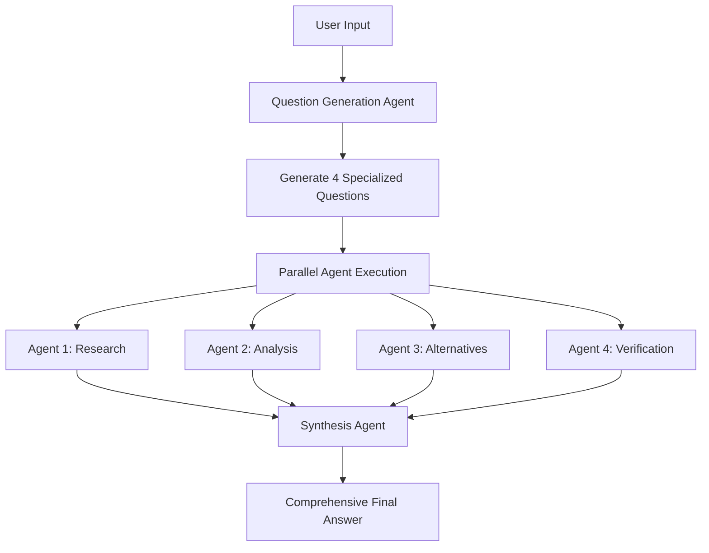

# 🚀 Make It heavy

A Python framework to emulate **SeedCode heavy** functionality using a powerful multi-agent system. Built on ZenMux's API, Make It heavy delivers comprehensive, multi-perspective analysis through intelligent agent orchestration.

## 🌟 Features

- **🧠 SeedCode heavy Emulation**: Multi-agent system that delivers deep, comprehensive analysis like SeedCode heavy mode
- **🔀 Parallel Intelligence**: Deploy 4 specialized agents simultaneously for maximum insight coverage
- **🎯 Dynamic Question Generation**: AI creates custom research questions tailored to each query
- **⚡ Real-time Orchestration**: Live visual feedback during multi-agent execution
- **🛠️ Hot-Swappable Tools**: Automatically discovers and loads tools from the `tools/` directory
- **🔄 Intelligent Synthesis**: Combines multiple agent perspectives into unified, comprehensive answers
- **🎮 Single Agent Mode**: Run individual agents for simpler tasks with full tool access

## 🚀 Quick Start

### Prerequisites

- Python 3.8+
- [uv](https://github.com/astral-sh/uv) (recommended Python package manager)
- ZenMux API key

### Installation

1. **Clone and setup environment:**
```bash
git clone <https://github.com/Doriandarko/make-it-heavy.git>
cd "make it heavy"

# Create virtual environment with uv
uv venv

# Activate virtual environment
source .venv/bin/activate  # On Windows: .venv\Scripts\activate
```

2. **Install dependencies:**
```bash
uv pip install -r requirements.txt
```

3. **Configure API key:**
```bash
# Edit config.yaml and replace YOUR API KEY HERE with your ZenMux API key
```

## 🎯 Usage

### Single Agent Mode

Run a single intelligent agent with full tool access:

```bash
uv run main.py
```

**What it does:**
- Loads a single agent with all available tools
- Processes your query step-by-step
- Uses tools like web search, calculator, file operations
- Returns comprehensive response when task is complete

**Example:**
```
User: Research the latest developments in AI and summarize them
Agent: [Uses search tool, analyzes results, provides summary]
```

### SeedCode heavy Mode (Multi-Agent Orchestration)

Emulate SeedCode heavy's deep analysis with 4 parallel intelligent agents:

```bash
uv run make_it_heavy.py
```

**How Make It heavy works:**
1. **🎯 AI Question Generation**: Creates 4 specialized research questions from your query
2. **🔀 Parallel Intelligence**: Runs 4 agents simultaneously with different analytical perspectives
3. **⚡ Live Progress**: Shows real-time agent status with visual progress bars
4. **🔄 Intelligent Synthesis**: Combines all perspectives into one comprehensive SeedCode heavy-style answer

**Example Flow:**
```
User Query: "Who is Pietro Schirano?"

AI Generated Questions:
- Agent 1: "Research Pietro Schirano's professional background and career history"
- Agent 2: "Analyze Pietro Schirano's achievements and contributions to technology"  
- Agent 3: "Find alternative perspectives on Pietro Schirano's work and impact"
- Agent 4: "Verify and cross-check information about Pietro Schirano's current role"

Result: SeedCode heavy-style comprehensive analysis combining all agent perspectives
```

## 🏗️ Architecture

### Orchestration Flow



### Core Components

#### 1. Agent System (`agent.py`)
- **Self-contained**: Complete agent implementation with tool access
- **Agentic Loop**: Continues working until task completion
- **Tool Integration**: Automatic tool discovery and execution
- **Configurable**: Uses `config.yaml` for all settings

#### 2. Orchestrator (`orchestrator.py`)
- **Dynamic Question Generation**: AI creates specialized questions
- **Parallel Execution**: Runs multiple agents simultaneously  
- **Response Synthesis**: AI combines all agent outputs
- **Error Handling**: Graceful fallbacks and error recovery

#### 3. Tool System (`tools/`)
- **Auto-Discovery**: Automatically loads all tools from directory
- **Hot-Swappable**: Add new tools by dropping files in `tools/`
- **Standardized Interface**: All tools inherit from `BaseTool`

### Available Tools

| Tool | Purpose | Parameters |
|------|---------|------------|
| `search_web` | Web search with DuckDuckGo | `query`, `max_results` |
| `calculate` | Safe mathematical calculations | `expression` |
| `read_file` | Read file contents | `path`, `head`, `tail` |
| `write_file` | Create/overwrite files | `path`, `content` |
| `mark_task_complete` | Signal task completion | `task_summary`, `completion_message` |

## ⚙️ Configuration

Edit `config.yaml` to customize behavior:

```yaml
# ZenMux API settings
zenmux:
  api_key: "YOUR KEY"
  base_url: "https://zenmux.ai/api/v1"
  model: "openai/gpt-4.1-mini"  # Change model here

# Agent settings
agent:
  max_iterations: 10

# Orchestrator settings
orchestrator:
  parallel_agents: 4  # Number of parallel agents
  task_timeout: 300   # Timeout per agent (seconds)
  
  # Dynamic question generation prompt
  question_generation_prompt: |
    You are an orchestrator that needs to create {num_agents} different questions...
    
  # Response synthesis prompt  
  synthesis_prompt: |
    You have {num_responses} different AI agents that analyzed the same query...

# Tool settings
search:
  max_results: 5
  user_agent: "Mozilla/5.0 (compatible; ZenMux Agent)"
```

## 🔧 Development

### Adding New Tools

1. Create a new file in `tools/` directory
2. Inherit from `BaseTool`
3. Implement required methods:

```python
from .base_tool import BaseTool

class MyCustomTool(BaseTool):
    @property
    def name(self) -> str:
        return "my_tool"
    
    @property
    def description(self) -> str:
        return "Description of what this tool does"
    
    @property
    def parameters(self) -> dict:
        return {
            "type": "object",
            "properties": {
                "param": {"type": "string", "description": "Parameter description"}
            },
            "required": ["param"]
        }
    
    def execute(self, param: str) -> dict:
        # Tool implementation
        return {"result": "success"}
```

4. The tool will be automatically discovered and loaded!

### Customizing Models

Supports any ZenMux-compatible model:

```yaml
zenmux:
  model: "anthropic/claude-3.5-sonnet"     # For complex reasoning
  model: "openai/gpt-4.1-mini"             # For cost efficiency  
  model: "google/gemini-2.0-flash-001"     # For speed
  model: "meta-llama/llama-3.1-70b"        # For open source
```

### Adjusting Agent Count

Change number of parallel agents:

```yaml
orchestrator:
  parallel_agents: 6  # Run 6 agents instead of 4
```

**Note**: Make sure your ZenMux plan supports the concurrent usage!

## 🎮 Examples

### Research Query
```bash
User: "Analyze the impact of AI on software development in 2024"

Single Agent: Comprehensive research report
SeedCode heavy Mode: 4 specialized perspectives combined into deep, multi-faceted analysis
```

### Technical Question  
```bash
User: "How do I optimize a React application for performance?"

Single Agent: Step-by-step optimization guide
SeedCode heavy Mode: Research + Analysis + Alternatives + Verification = Complete expert guide
```

### Creative Task
```bash
User: "Create a business plan for an AI startup"

Single Agent: Structured business plan
SeedCode heavy Mode: Market research + Financial analysis + Competitive landscape + Risk assessment
```

## 🛠️ Troubleshooting

### Common Issues

**API Key Error:**
```
Error: Invalid API key
Solution: Update config.yaml with valid ZenMux API key
```

**Tool Import Error:**
```
Error: Could not load tool from filename.py
Solution: Check tool inherits from BaseTool and implements required methods
```

**Synthesis Failure:**
```
🚨 SYNTHESIS FAILED: [error message]
Solution: Check model compatibility and API limits
```

**Timeout Issues:**
```
Agent timeout errors
Solution: Increase task_timeout in config.yaml
```

### Debug Mode

For detailed debugging, modify orchestrator to show synthesis process:

```python
# In orchestrator.py
synthesis_agent = ZenMuxAgent(silent=False)  # Enable debug output
```

## 📁 Project Structure

```
make it heavy/
├── main.py                 # Single agent CLI
├── make_it_heavy.py         # Multi-agent orchestrator CLI  
├── agent.py                # Core agent implementation
├── orchestrator.py         # Multi-agent orchestration logic
├── config.yaml             # Configuration file
├── requirements.txt        # Python dependencies
├── README.md               # This file
└── tools/                  # Tool system
    ├── __init__.py         # Auto-discovery system
    ├── base_tool.py        # Tool base class
    ├── search_tool.py      # Web search
    ├── calculator_tool.py  # Math calculations  
    ├── read_file_tool.py   # File reading
    ├── write_file_tool.py  # File writing
    └── task_done_tool.py   # Task completion
```

## 🤝 Contributing

1. Fork the repository
2. Create a feature branch
3. Add new tools or improve existing functionality
4. Test with both single and multi-agent modes
5. Submit a pull request

## 📝 License

MIT License with Commercial Attribution Requirement

**For products with 100K+ users**: Please include attribution to Pietro Schirano and mention the "Make It heavy" framework in your documentation or credits.

See [LICENSE](LICENSE) file for full details.

## 🙏 Acknowledgments

- Built with [ZenMux](https://zenmux.ai/) for LLM API access
- Uses [uv](https://github.com/astral-sh/uv) for Python package management
- Inspired by **SeedCode heavy** mode and advanced multi-agent AI systems

---

**Ready to make it heavy?** 🚀

```bash
uv run make_it_heavy.py
```

## Star History

[](https://www.star-history.com/#Doriandarko/make-it-heavy&Date)